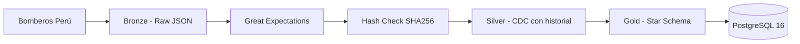

# AGENTS.md — ETL-ACCIDENTES

Pipeline ETL que extrae emergencias en tiempo real del Cuerpo de Bomberos del Perú, aplica CDC con tracking histórico y modela los datos en un Star Schema sobre PostgreSQL 16.

**Stack**: Python 3.14 · Apache Airflow 3.1.8 · CeleryExecutor · PostgreSQL 16 · Redis · Docker Compose · Great Expectations · pytest

---

## 1. Arquitectura



### Flujo del DAG (`pipeline_accidents` — 9 tareas secuenciales)

1. **task_fetch** — Descarga HTML con retry (3 intentos, backoff)
2. **task_parse** — Extrae tabla HTML → JSON (7 columnas)
3. **task_validate_bronze** — Great Expectations (row count ≥ 1, no nulos)
4. **task_hash_check** — SHA256 vs hash anterior → skip si no hay cambios
5. **task_upload** — Guarda raw JSON en `data/bronze/` particionado por fecha
6. **task_silver** — Limpieza → CDC upsert con histórico de cambios de estado
7. **task_gold** — Construye 4 dimensiones + 1 fact table con turno calculado
8. **task_save_hash** — Persiste hash en `pipeline_hash_log`
9. **task_cleanup** — Elimina archivos temporales (trigger_rule=all_done)

### Star Schema

| Tabla | Propósito |
|---|---|
| `DIM_TIPO` | Jerarquía de tipo de emergencia (categoría → subcategoría → detalle) |
| `DIM_DISTRITO` | Referencia de distritos de Lima |
| `DIM_ESTADO` | Estados posibles (ATENDIENDO, CERRADO, CONTROLADO, etc.) |
| `DIM_TIEMPO` | Dimensión temporal con PK YYYYMMDD, nombres en español |
| `FACT_EMERGENCIA` | Fact table con 4 FK, TURNO, coordenadas, conteo de máquinas |

---

## 2. Reglas NO negociables

| Regla | Explicación |
|---|---|
| **Logs y docstrings en español** | El dominio del negocio es Perú; el usuario final habla español |
| **Código (variables, funciones, clases) en inglés** | Estándar de la industria; cualquier ingeniero debe entender el código |
| **No usar GCS / Google Cloud** | Se eliminó todo rastro de GCP del proyecto |
| **El DAG es el pipeline** | No existe `main.py` ni scripts de ejecución directa |
| **No tocar `config/airflow.cfg`** | 3274 líneas de default de Airflow; solo 2 líneas custom (executor y sql_alchemy_conn) |
| **pytest solo en dev** | No incluir pytest en la imagen Docker |
| **Usar `uv`, no pip** | `uv sync` para instalar, `uv run` para ejecutar, `uv export` para requirements.txt |

---

## 3. Mapa de módulos

### `src/extract/scraper.py` — Web scraping

- `fetch_html(url, max_retries, delay)` — GET con retry + backoff
- `scrape_website(html)` — BeautifulSoup: extrae tabla de 7 columnas
- `normalize_newlines(value)` — Normaliza saltos de línea en columna Maquinas

### `src/transform/transform_silver.py` — Limpieza y transformación a Silver

- `transform_to_silver(records)` — Orquesta todas las transformaciones
- `strip_whitespace(df)` — Elimina espacios sobrantes
- `parse_datetime(df)` — Convierte `Fecha_hora` a datetime
- `split_address(df)` — Separa dirección y distrito
- `extract_coordinates(df)` — Extrae latitud/longitud de coordenadas
- `split_tipo(df)` — Descompone `Tipo` en 3 niveles jerárquicos
- `count_machineries(df)` — Cuenta máquinas separadas por `|`

### `src/transform/transform_gold.py` — Modelo dimensional Gold

- `transform_to_gold(df)` — Orquesta dimensiones + fact
- `build_dim_tipo(df)` — DIM_TIPO con jerarquía
- `build_dim_distrito(df)` — DIM_DISTRITO
- `build_dim_estado(df)` — DIM_ESTADO
- `build_dim_tiempo(df)` — DIM_TIEMPO con PK YYYYMMDD + turno
- `build_fact_emergencia(df, dim_tipo, dim_distrito, dim_estado, dim_tiempo)` — Fact table con FK resueltas

### `src/validation/validate_bronze.py` — Data Quality

- `validate_bronze(df)` — Great Expectations: row count ≥ 1, no nulos en NroParte/Fecha_hora, columnas esperadas

### `src/load/raw_to_storage.py` — Carga Bronze

- `upload_raw_data(records, ingestion_datetime)` — Guarda JSON particionado en `data/bronze/accidentes/`

### `src/load/silver_to_storage.py` — Carga Silver con CDC

- `upload_silver_data(df)` — CDC: consulta estados actuales vs batch, decide INSERT/UPDATE/ignorar
- `_get_estados_actuales(cur, nro_partes)` — Query única con `ANY(%s)` para todo el batch
- `_insert_nuevo(cur, row)` — INSERT con `es_actual=TRUE`
- `_update_estado(cur, row, estado_anterior)` — Marca FALSE + INSERT nuevo con historial
- Retorna `{"insertados": N, "actualizados": N, "ignorados": N}`

### `src/load/gold_to_storage.py` — Carga Gold (Star Schema)

- `upload_gold_data(dim_tipo, dim_distrito, dim_estado, dim_tiempo, fact_emergencia)` — Upserts 4 dimensiones con `ON CONFLICT DO NOTHING` + INSERT fact con FK reales
- `_upsert_dim(cur, table, df, conflict_col, update_cols)` — Genérico para cualquier dimensión
- `_resolve_fact_ids(cur, fact_emergencia, dim_map)` — Re-resuelve IDs de DB (los IDs secuenciales de transform_gold no coinciden con los SERIAL de PostgreSQL)

### `src/load/hash_to_storage.py` — Hash persistence

- `load_last_hash()` — Lee último hash de `pipeline_hash_log`
- `save_hash(hash_value)` — Inserta nuevo hash con pipeline_id y timestamp

### `src/utils/hashing.py` — Utilidad de hash

- `calculate_df_hash(df)` — SHA256 determinístico (ordena por NroParte)

### `dags/dag_accidents.py` — Orquestación Airflow

- DAG `pipeline_accidents` con `schedule=None` (trigger manual)
- 9 tasks con `retries=3` y `execution_timeout=300s`
- Tags: `["scraping", "bomberos"]`

---

## 4. Decisiones técnicas clave

| Decisión | Por qué |
|---|---|
| **CDC tipo SCD Type 2** | Mantiene historial completo de cambios de estado; `es_actual` + `estado_anterior` permiten reconstruir la línea de tiempo |
| **Hash SHA256 para skip** | Evita reprocesar datos idénticos; ahorra tiempo y recursos en ejecuciones repetidas |
| **Gold usa upsert (ON CONFLICT DO NOTHING)** | Las dimensiones son acumulativas; no queremos duplicados por nombre |
| **`_get_env()` duplicado** | Está definido idénticamente en `silver_to_storage.py` y `hash_to_storage.py` — pendiente de extraer a `src/utils/db.py` |
| **TEMP en `/opt/airflow/data/tmp/`** | Volumen compartido entre workers de Celery; asegura que cualquier worker pueda acceder al archivo temporal |
| **DAG manual (`schedule=None`)** | Los datos de Bomberos se actualizan en tiempo real sin horario fijo; el trigger manual permite decidir cuándo extraer |
| **Bronze en disco (no DB)** | Raw JSON preserva el original inmutable; si la transformación cambia, se reprocesa desde Bronze sin re-scrapear |
| **_get_connection() importado de silver** | `gold_to_storage.py` importa `from src.load.silver_to_storage import _get_connection` — es una función privada, debería estar en utils |

---

## 5. Estado actual — Code Quality Score

| Categoría | Score | Issues principales |
|---|---|---|
| Code Quality | 6/10 | `_get_env()` duplicado; FK resuelta dos veces (transform + load de Gold) |
| Architecture | 7/10 | Medallón bien separado; Gold loader re-hace transformaciones |
| Imports | 7/10 | Sin imports circulares; faltan `__init__.py` en `src/load/` y `src/transform/` |
| Type Hints | 5/10 | Solo ~40% coverage; `transform_silver.py` tiene 0% |
| Docstrings | 7/10 | Buenos en español; DAG mezcla inglés/español |
| Testing | 4/10 | 4/9 módulos tienen tests; `validate_bronze.py`, `transform_gold.py`, `gold_to_storage.py` no tienen ninguno |
| Security | 7/10 | `.env` correctamente ignorado por `.gitignore`; credenciales default (airflow) |
| Configuration | 5/10 | Paths hardcodeados (`BASE_PATH`, tmp); DB vars bien externalizadas |
| **Overall** | **6/10** | Base sólida; gaps en tests, types y configuración |

---

## 6. Deuda técnica priorizada

### 🔴 CRÍTICO

- [x] **`.env` en git** — ✅ Ya en `.gitignore`. No hay commits aún, no requiere `git rm --cached`.
- [ ] **Extraer `_get_env()` y `_get_connection()`** a `src/utils/db.py` — Elimina duplicación entre `silver_to_storage.py`, `hash_to_storage.py` y el DAG.

### 🟡 ALTA

- [ ] **Tests para `validate_bronze.py`** — Módulo de calidad de datos sin cobertura.
- [ ] **Tests para `transform_gold.py`** — Corazón del modelo dimensional sin tests.
- [ ] **Tests para `gold_to_storage.py`** — Lógica de upsert + resolución de FKs.
- [ ] **Tests para `raw_to_storage.py`** — E/S a disco sin cobertura.
- [ ] **Tests para `transform_silver.py`** — El archivo `test_transform_silver.py` en realidad prueba `silver_to_storage.py` (el loader), no la transformación.
- [ ] **Renombrar `tests/test_transform_silver.py`** → `tests/test_silver_to_storage.py` para reflejar lo que prueba.

### 🔵 MEDIA

- [ ] **Type hints en `transform_silver.py`** — 7 funciones, 0 type hints. Es el módulo más visitado por futuros mantenedores.
- [ ] **Type hints en `transform_gold.py`** — Coverage parcial (~17%).
- [ ] **Externalizar `BASE_PATH`** en `raw_to_storage.py:9` a variable de entorno.
- [ ] **Externalizar temp path** en `dag_accidents.py:69` a variable de entorno.
- [ ] **FK resuelta dos veces** — `build_fact_emergencia()` asigna IDs secuenciales falsos, luego `_resolve_fact_ids()` los reemplaza con IDs reales. La transformación debería ocurrir una sola vez.

### ⚪ BAJA

- [ ] **Agregar `__init__.py`** a `src/load/` y `src/transform/`.
- [ ] **Mover `import pandas` y `import psycopg2`** dentro de funciones del DAG (reducir parse time).
- [ ] **Extraer constantes de turno** (`bins=[-1, 5, 11, 18, 23]` y labels) a constante de módulo.
- [ ] **Unificar idioma en docstrings del DAG** (mezcla español/inglés).
- [ ] **Corregir type hint de `normalize_newlines()`** — declarado como `str -> str` pero retorna `None` para input `None`.

---

## 7. Cómo trabajar

### Tests

```bash
uv run pytest tests/ -v        # Todos los tests
uv run pytest tests/test_scraper.py -v  # Solo scraper
```

### Entorno local

```bash
cp .env.example .env          # Primera vez
docker compose up -d           # Levanta Airflow + Postgres + Redis
# Trigger manual del DAG en http://localhost:8080
```

### Package manager

```bash
uv sync                        # Instalar dependencias
uv add <package>               # Agregar dependencia
uv export --no-dev > requirements.txt  # Regenerar requirements para Docker
```

### Python

Versión: **3.14** (pinned en `.python-version`)

---

## 8. Git

- **No hay commits aún** — todos los archivos están untracked.
- **`git user.name`** = `joel` ; **`git user.email`** = `joel301196@gmail.com`
- **`gh` (GitHub CLI) no disponible** — crear repo via browser.
- **`.env` ya está en `.gitignore`** — no requiere `git rm --cached`, no hay commits aún.

### Workflow para el primer commit

```bash
git add .
git commit -m "first commit: ETL pipeline Bomberos Peru con medallion + CDC + Star Schema"
git remote add origin https://github.com/<user>/ETL-ACCIDENTES.git
git push -u origin main
```

---

## 9. Tests — estado actual

| Test file | Lo que prueba | Tests | Estado |
|---|---|---|---|
| `tests/test_hashing.py` | `hashing.py` | 4 | ✅ Todos pasan |
| `tests/test_scraper.py` | `scraper.py` | 4 | ✅ Todos pasan |
| `tests/test_hash_to_storage.py` | `hash_to_storage.py` | 3 | ✅ Todos pasan |
| `tests/test_transform_silver.py` | `silver_to_storage.py` (no confundir) | 7 | ✅ Todos pasan |
| **Total** | | **18** | ✅ **18/18 pasando** |

### Sin cobertura

| Módulo | Archivo de test esperado |
|---|---|
| `validate_bronze.py` | `tests/test_validate_bronze.py` |
| `raw_to_storage.py` | `tests/test_raw_to_storage.py` |
| `transform_silver.py` | `tests/test_transform_silver.py` (nombre correcto pero probando otra cosa) |
| `transform_gold.py` | `tests/test_transform_gold.py` |
| `gold_to_storage.py` | `tests/test_gold_to_storage.py` |

---

## 10. Referencias rápidas

| Comando | Descripción |
|---|---|
| `uv run pytest tests/ -v` | Ejecutar todos los tests |
| `docker compose up -d` | Levantar stack completo |
| `docker compose down -v` | Bajar y borrar volúmenes |
| `docker compose logs -f airflow-scheduler` | Ver logs del scheduler |
| `uv export --no-dev > requirements.txt` | Regenerar requirements.txt |

### Archivos clave

| Archivo | Ruta |
|---|---|
| DAG principal | `dags/dag_accidents.py` |
| Config Airflow | `config/airflow.cfg` (no tocar) |
| Docker Compose | `docker-compose.yaml` |
| Dependencias | `pyproject.toml` |
| Scripts DB | `scripts/initdb/` |
| Env vars | `.env` (no committear) |
| Env template | `.env.example` |
