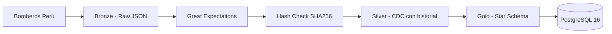

# 🚒 ETL-ACCIDENTES

**De la web de Bomberos Perú a tu base de datos analítica. Sin clicks, sin Excel, sin intervención manual.**

Un pipeline ETL que extrae emergencias en tiempo real del Cuerpo de Bomberos del Perú, las limpia aplicando Change Data Capture con histórico de cambios, y las modela en un Star Schema listo para dashboards de BI.

**1 comando para levantar todo:** `docker compose up -d`

     

---

## Resultados

- **9 tareas orquestadas** en Airflow, desde scraping hasta modelo analítico
- **7 tablas en PostgreSQL 16** con esquema dimensional listo para consultas BI
- **18 tests automatizados** con pytest (100% pasando)
- **8 servicios Docker** (Airflow + Celery + PostgreSQL + Redis)
- **Desplegable con 1 comando**

## Diseño del pipeline

- **CDC tipo 2** en Silver con `es_actual` y `estado_anterior` — cada cambio de estado se registra sin perder el histórico
- **Hash SHA256** como guard rail — si los datos no cambiaron respecto a la ejecución anterior, se salta todo el procesamiento
- **Star Schema en Gold** con 4 dimensiones (Tiempo, Tipo, Distrito, Estado) + fact table con turno calculado — pensado para dashboards
- **Volumen compartido** entre workers de Celery — escalable horizontalmente sin cambiar una línea
- **Great Expectations** validando cada batch antes de persistir — la calidad de datos es parte del pipeline, no un paso aparte

## Arquitectura



## Stack

| Categoría | Tecnología |
|---|---|
| Lenguaje | Python 3.14 con uv |
| Orquestación | Apache Airflow 3.1.8 + Celery + Redis |
| Base de datos | PostgreSQL 16 |
| Calidad de datos | Great Expectations |
| Infraestructura | Docker Compose (8 servicios) |
| Testing | pytest (18 tests) |

## Cómo ejecutar

```bash
cp .env.example .env
docker compose up -d
```

Trigger manual del DAG `pipeline_accidents` en `http://localhost:8080`.

## Estructura

```
src/
├── extract/scraper.py          # Web scraping
├── transform/                  # Transformaciones Silver → Gold
├── validation/                 # Great Expectations
├── load/                       # Carga CDC (Silver + Gold + Hash)
├── utils/hashing.py            # SHA256
dags/dag_accidents.py           # 9 tareas en secuencia
scripts/initdb/                 # 7 scripts SQL (esquema completo)
tests/                          # 18 tests
```
