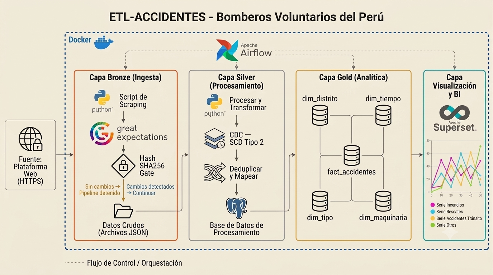

# ETL-ACCIDENTES — Bomberos Perú

**De la web de Bomberos Perú a tu base de datos analítica. Sin clicks, sin Excel, sin intervención manual.**

Pipeline ETL que extrae emergencias en tiempo real del Cuerpo General de Bomberos Voluntarios del Perú (Dirección de Comunicaciones — Oficina de Tecnología y Comunicaciones), las limpia aplicando Change Data Capture con historial de cambios, y las modela en un Star Schema listo para dashboards de BI.

```bash
docker compose up -d  # 1 comando para levantar todo
```


---

## ¿Qué hace?

| | |
|---|---|
| 🔄 **Extrae** | Scraping de la plataforma pública SGNORTE del Cuerpo de Bomberos Perú |
| 🧹 **Limpia** | CDC Tipo 2 — historial completo de cambios de estado por emergencia |
| 📐 **Modela** | Star Schema en PostgreSQL listo para dashboards BI |
| ⚡ **Optimiza** | Hash SHA256 — salta el procesamiento si los datos no cambiaron |
| ✅ **Valida** | Great Expectations en cada batch antes de persistir |

---

## Resultados

- 🔁 **9 tareas orquestadas** en Airflow — desde scraping hasta modelo analítico
- 🗄️ **7 tablas en PostgreSQL 16** con esquema dimensional listo para BI
- 🧪 **62 tests automatizados** con pytest (9/9 módulos cubiertos)
- 🐳 **8 servicios Docker** — Airflow + Celery + PostgreSQL + Redis
- 🚀 **Desplegable con 1 comando**

---

## Arquitectura



```
🌐 SGNORTE          →    🥉 Bronze       →    🥈 Silver        →    🥇 Gold
Plataforma Bomberos       RAW JSON             PostgreSQL            PostgreSQL
Web scraping              Great Expectations   CDC + SCD Tipo 2      Star Schema
                          Hash SHA256          es_actual             4 dims + FACT
```

---

## Diseño del Pipeline

**🥉 Bronze — Ingesta raw**
Datos crudos guardados como JSON en disco. Great Expectations valida campos obligatorios y estructura antes de continuar. Hash SHA256 detecta si los datos cambiaron — si no, el pipeline se detiene.

**🥈 Silver — Limpieza y CDC**
CDC Tipo 2 con `es_actual` y `estado_anterior` — cada cambio de estado genera una nueva fila sin perder el historial. Separación de dirección, distrito, coordenadas y jerarquía de tipo de emergencia.

**🥇 Gold — Modelo estrella**
4 dimensiones (Tiempo, Tipo, Distrito, Estado) + `FACT_EMERGENCIA` con TURNO calculado desde la hora real del incidente. Carga con `ON CONFLICT DO UPDATE` — siempre refleja el estado vigente.

---

## Stack

| Categoría | Tecnología |
|---|---|
| Lenguaje | Python 3.14 con uv |
| Orquestación | Apache Airflow 3.1.8 + Celery + Redis |
| Base de datos | PostgreSQL 16 |
| Calidad de datos | Great Expectations |
| Infraestructura | Docker Compose (8 servicios) |
| Testing | pytest (62 tests, 9/9 módulos) |

---

## Cómo Ejecutar

```bash
# 1. Clonar
git clone https://github.com/JoelIFBB/ETL-ACCIDENTES-BOMBEROS-PERU.git
cd ETL-ACCIDENTES-BOMBEROS-PERU

# 2. Configurar entorno (editar BOMBEROS_DB_USER y BOMBEROS_DB_PASSWORD)
cp .env.example .env

# 3. Levantar
docker compose up -d
```

Accede a Airflow en `http://localhost:8080` y activa el DAG `pipeline_accidents`.

---

## Estructura

```
src/
├── extract/scraper.py           # Web scraping (fetch + parse HTML)
├── transform/
│   ├── transform_silver.py      # Limpieza, normalización, separación de campos
│   └── transform_gold.py        # Construcción del Star Schema
├── validation/validate_bronze.py # Great Expectations
├── load/
│   ├── raw_to_storage.py        # Bronze — JSON en disco
│   ├── silver_to_storage.py     # Silver — CDC loader
│   ├── gold_to_storage.py       # Gold — dimensiones + FACT
│   └── hash_to_storage.py       # Hash persistence
└── utils/
    └── hashing.py               # SHA256

dags/dag_accidents.py            # 9 tareas en secuencia
scripts/initdb/                  # 7 scripts SQL — esquema completo
tests/
├── test_scraper.py
├── test_hashing.py
├── test_hash_to_storage.py
├── test_silver_to_storage.py
├── test_transform_silver.py
├── test_transform_gold.py
├── test_validate_bronze.py
├── test_gold_to_storage.py
└── test_raw_to_storage.py
```

---

## Documentación

| Recurso | Descripción |
|---|---|
| [`scripts/initdb/`](scripts/initdb/) | Esquema dimensional completo — 7 tablas con índices |
| [`docker-compose.yaml`](docker-compose.yaml) | Infraestructura: 8 servicios, volúmenes compartidos, healthchecks |
| [`ETL-ACCIDENTES.png`](ETL-ACCIDENTES.png) | Diagrama de arquitectura del pipeline |

---

## Tests

```bash
pytest tests/  # 62 tests, 9/9 módulos
```

---

## Autor

**Joel**
- GitHub: [@JoelIFBB](https://github.com/JoelIFBB)
